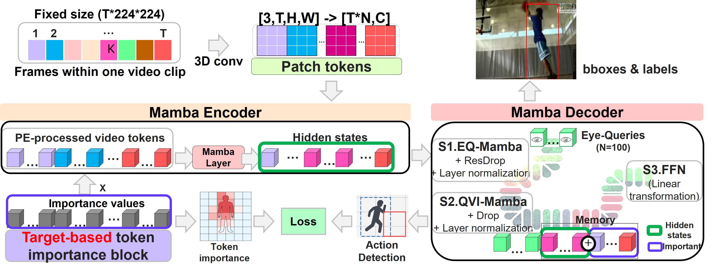

# Mamba Only Glances Once (MOGO): A Lightweight Framework for Efficient Video Action Detection

> **NeurIPS 2025 (Poster)**  
> Fujitsu R&D Center (Shanghai) × Fujitsu Research Japan  

---

<p align="center">
  
</p>

---

## 🔍 About

**MOGO (Mamba Only Glances Once)** is a lightweight and fully Mamba-based framework for spatio-temporal action detection.  

**Key highlights:**
- 🧠 Pure Mamba encoder-decoder  
- ⚡ Token importance selection  

---

## 🧪 Citation

```bibtex
@inproceedings{liu2025mogo,
  title     = {Mamba Only Glances Once (MOGO): A Lightweight Framework for Efficient Video Action Detection},
  author    = {Liu, Yunqing and Zhang, Nan and Wang, Fangjun and Murata, Kengo and Yamamoto, Takuma and Nakayama, Osafumi and Suzuki, Genta and Tan, Zhiming},
  booktitle = {Advances in Neural Information Processing Systems (NeurIPS)},
  year      = {2025}
}
```


---

> We sincerely thank the reviewers for thier valuable feedback that helped improve this work.
